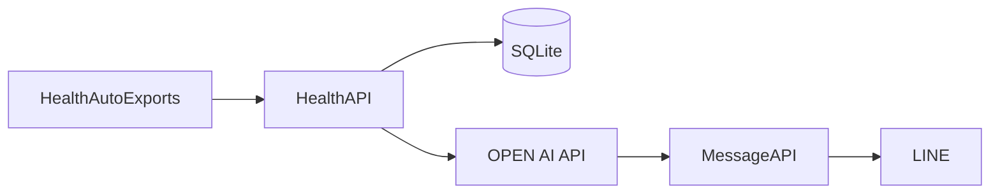
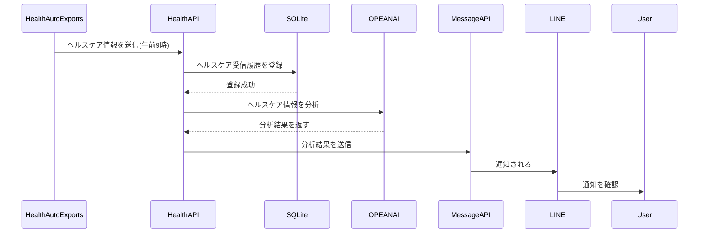
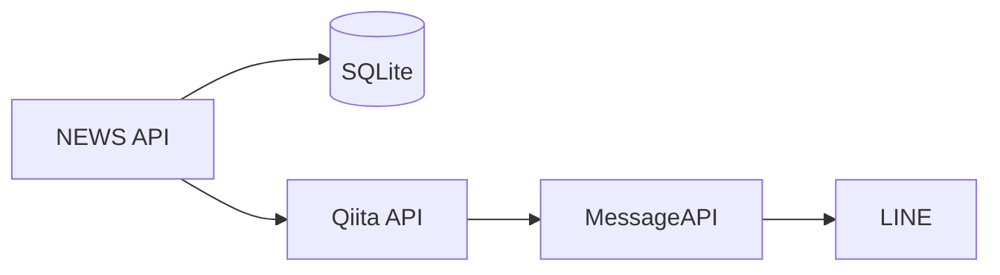
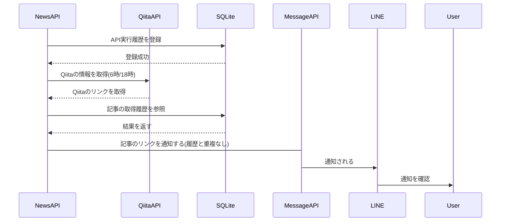

# 02. システム構成

###  ヘルスケア分析結果を通知

```mermaid
flowchart LR
  HealthAutoExports[HealthAutoExports] --> HealthAPI[HealthAPI]
  HealthAPI[HealthAPI] --> SQLite[(SQLite)]
  HealthAPI[HealthAPI] --> OPENAI[OPEN AI API]
  OPENAI[OPEN AI API] --> MessageAPI[MessageAPI]
  MessageAPI[MessageAPI] --> LINE[LINE]
```

```mermaid
sequenceDiagram
  participant AHE as HealthAutoExports
  participant HA as HealthAPI
  participant DB as SQLite
  participant OA as OPEANAI
  participant MA as MessageAPI
  participant L as LINE
  participant U as User

  AHE->>HA: ヘルスケア情報を送信(午前9時)
  HA->>DB: ヘルスケア受信履歴を登録
  DB-->>HA: 登録成功
  HA->>OA: ヘルスケア情報を分析
  OA-->>HA: 分析結果を返す
  HA->>MA: 分析結果を送信
  MA->>L: 通知される
  L->>U: 通知を確認
```
---
###  Qiitaの記事リンクを通知

```mermaid
flowchart LR
  NEWSAPI[NEWS API] --> SQLite[(SQLite)]
  NEWSAPI[NEWS API] --> QiitaAPI[Qiita API]
  QiitaAPI[Qiita API] --> MessageAPI[MessageAPI]
  MessageAPI[MessageAPI] --> LINE[LINE]
```

```mermaid
sequenceDiagram
  participant NA as NewsAPI
  participant QA as QiitaAPI
  participant DB as SQLite
  participant MA as MessageAPI
  participant L as LINE
  participant U as User

  NA->>DB: API実行履歴を登録
  DB-->>NA: 登録成功
  NA->>QA: Qiitaの情報を取得(6時/18時)
  QA-->>NA: Qiitaのリンクを取得
  NA->>DB: 記事の取得履歴を参照
  DB-->>NA: 結果を返す 
  NA->MA: 記事のリンクを通知する(履歴と重複なし)
  MA->>L: 通知される
  L->>U: 通知を確認
```
