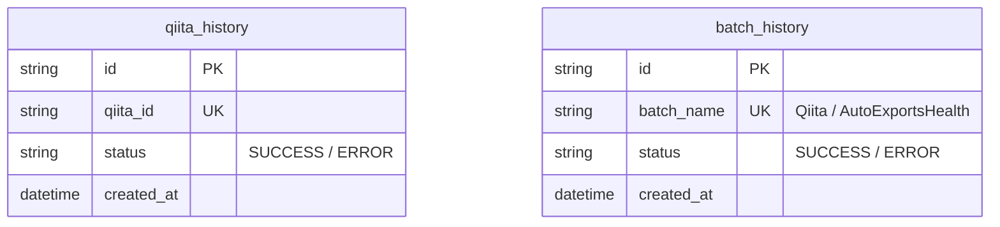

# 03. データモデル

使用するDB：SQLite

## ER図（論理）

```mermaid
erDiagram

  qiita_history {
    string id PK
    string qiita_id UK
    string status "SUCCESS / ERROR"
    datetime created_at
  }

  batch_history {
    string id PK
    string batch_name UK "Qiita / AutoExportsHealth"
    string status "SUCCESS / ERROR"
    datetime created_at
  }

```

